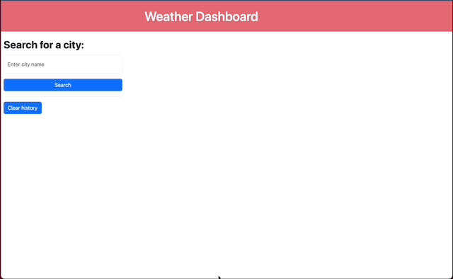
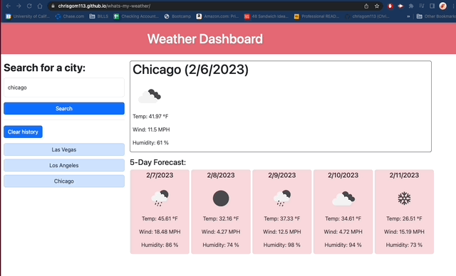
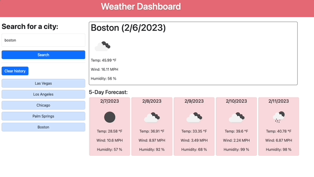

# whats-my-weather

Live URL: https://chrisgom113.github.io/whats-my-weather/

## Description

This week's challenge tested our developer skills by allowing for us to build on server API integration methods as well as client storage methods.
The task is creating a weather dashboard that, aside from having polished HTML and CSS user-interface, allows users to input a city name into a field
and for the current weather data to appear, along with a 5 day forecast of the same city and the same data. To enhance this, the user is also able to 
view their recent searches as they appear in a list with each new search. This search history contains functionality as well, whereby the user may click 
on each recent search query to see that search re-appear with current and forecasted weather data.

## Usage

User acceses web app using the following URL: https://chrisgom113.github.io/whats-my-weather/

User can enter city name into the search box to see current weather data and 5-day forecast. They will also see their search added to a search history column

On page refresh, recent search data persists on the page

User can click on a recent search to the same data appear again

## Features

Web app includes:

- HTML, CSS, Javascript languages
- jquery, bootstrap, Day.js browser APIs
- https://openweathermap.org/api server API
- client storage functionality